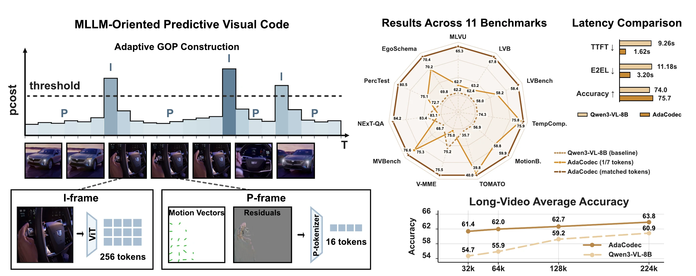
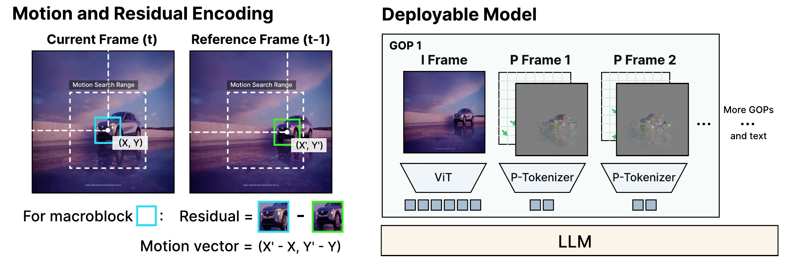
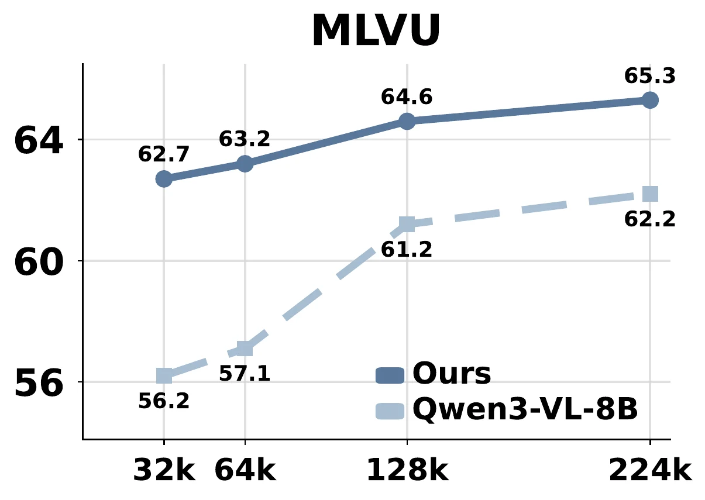
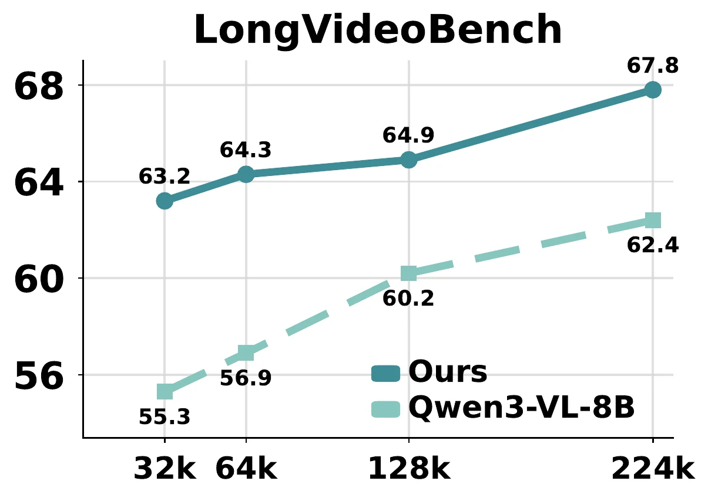
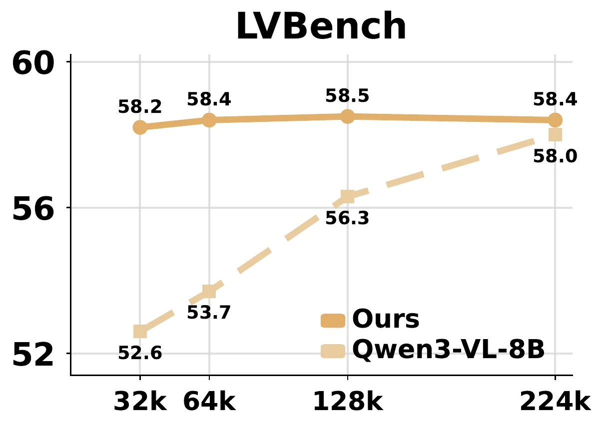
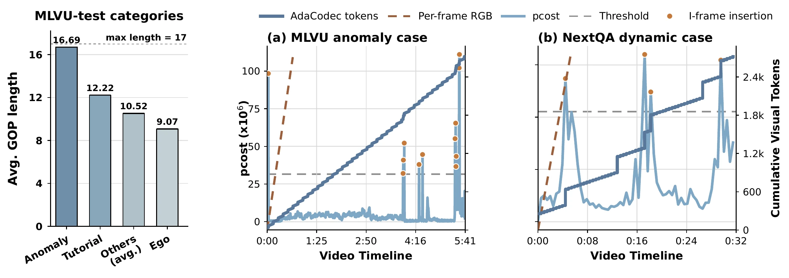

<h1 align="center">AdaCodec: A Predictive Visual Code<br>for Video MLLMs</h1>

<p align="center">
  <a href="https://haowenhou.github.io/"><strong>Haowen Hou<sup>1,2,3*</sup></strong></a> &nbsp;
  <a href="https://huangzhen02.github.io/"><strong>Zhen Huang<sup>2</sup></strong></a> &nbsp;
  <strong>Zheming Liang<sup>2</sup></strong> &nbsp;
  <a href="https://phoebussi.github.io/"><strong>Qingyi Si<sup>3</sup></strong></a> &nbsp;
  <strong>Chenglin Li<sup>2</sup></strong><br>
  <strong>Shuai Dong<sup>2</sup></strong> &nbsp;
  <a href="https://cokeshao.github.io/"><strong>Kele Shao<sup>2</sup></strong></a> &nbsp;
  <strong>Ruilin Li<sup>2</sup></strong> &nbsp;
  <strong>Dianyi Wang<sup>2</sup></strong> &nbsp;
  <a href="https://nanduan.github.io/"><strong>Nan Duan<sup>3</sup></strong></a> &nbsp;
  <a href="https://myownskyw7.github.io/"><strong>Jiaqi Wang<sup>3,2&dagger;</sup></strong></a>
</p>

<p align="center">
  <sup>1</sup>Shanghai Jiao Tong University &nbsp;
  <sup>2</sup>Shanghai Innovation Institute &nbsp;
  <sup>3</sup>JD.com<br>
  <sup>*</sup>Work done during an internship at JD.com &nbsp;
  <sup>&dagger;</sup>Corresponding author
</p>

<p align="center">
  <a href="https://HaowenHou.github.io/AdaCodec-Page/"><strong>Project Page</strong></a> &nbsp;|&nbsp;
  <strong>Code: coming soon</strong>
</p>

<p align="center">
  🔥 <strong>AdaCodec is used in <a href="https://joyai-vl-video-future-academy-jd.github.io/JoyAI-VL-Interaction/">JoyAI-VL-Interaction: Real-Time Vision-Language Interaction Intelligence</a>, whose code, models, and data will all be open-sourced.</strong>
</p>

> This repository is a public placeholder for the AdaCodec code release. It currently contains project information and figures only.



AdaCodec forms adaptive groups of pictures, encodes I-frames with full visual tokens, and encodes intermediate frames with compact P-tokens derived from motion and residual signals.

## Abstract

Video is temporally redundant: adjacent frames usually share most objects, background, and layout. Yet existing video multimodal large language models (video MLLMs) usually encode each sampled frame as an independent RGB image, causing visual tokens to repeat content already present in earlier frames. This suggests a more direct video interface: 
send a full reference frame only when the scene cannot be predicted well from prior context, and otherwise transmit a compact description of inter-frame changes. We call this interface a predictive visual code, and instantiate it for video MLLMs as AdaCodec. AdaCodec spends full visual tokens on a reference frame only when its conditional predictive cost is high; otherwise, it encodes inter-frame changes, including motion and prediction residuals, as compact P-tokens. Across all eleven benchmarks, AdaCodec improves over the Qwen3-VL-8B per-frame RGB baseline at a matched visual-token budget. Even at $1/7$ the budget, AdaCodec with 32k tokens surpasses the 224k baseline on all long-video benchmarks; on five general-video benchmarks, it raises the average score while substantially cutting time-to-first-token from 9.26s to 1.62s.

## Highlights

| Result | Description |
| --- | --- |
| 1/7 visual-token budget | Still surpasses the 224k-token RGB baseline on all reported long-video benchmarks. |
| 84.7% token reduction | Average visual-token reduction over 11,347 evaluation videos. |
| 5.7x lower TTFT | Lower time-to-first-token before charging the 0.12s codec-build step. |
| 11 benchmarks | Long-video, temporal, and general video-understanding tasks. |

## Method

AdaCodec changes playback-oriented predictive coding into a visual-token interface for video MLLMs. The design uses ViT-aligned macroblocks, previous-frame motion reference, a larger search window for low-FPS sampling, and a predictive-cost signal reused for adaptive group-of-pictures scheduling.



The pipeline has three main parts:

1. **Predictive-code construction.** Motion search produces a frame-level predictive cost. AdaCodec starts a new I-frame when predictive cost crosses a threshold and keeps predictable frames as compact P-frames.
2. **Dual-branch tokenization.** I-frames use the native visual encoder, while P-frames use a P-tokenizer over residual and motion inputs.
3. **Two-stage alignment.** Stage 1 aligns P-tokens to frozen visual teacher features. Stage 2 aligns the full visual code with the language model.

## Main Results

At a comparable token budget, AdaCodec improves over the Qwen3-VL-8B per-frame RGB baseline on every reported benchmark. At about one seventh of the token budget, it preserves accuracy across benchmark groups and exceeds the high-budget RGB baseline on long-video tasks.

| Method | MLVU | LVB | LVBench | TempComp. | MotionB. | TOMATO | V-MME | MVBench | NExT-QA | PercTest | EgoSchema |
| --- | ---: | ---: | ---: | ---: | ---: | ---: | ---: | ---: | ---: | ---: | ---: |
| Qwen3-VL-8B | 62.2 | 62.4 | 58.0 | 74.3 | 56.9 | 35.7 | 75.2 | 68.7 | 83.4 | 72.7 | 69.8 |
| AdaCodec, 1/7 token budget | 62.7 | 63.2 | 58.2 | 75.8 | 58.8 | 39.8 | 75.0 | 75.3 | 83.1 | 75.1 | 70.2 |
| AdaCodec, comparable token budget | **65.3** | **67.8** | **58.4** | **75.9** | **59.9** | **40.0** | **75.5** | **76.6** | **84.2** | **80.5** | **70.4** |

LVB denotes LongVideoBench, and V-MME denotes Video-MME. Higher is better.

## Efficiency

The latency evaluation uses matched hardware, batch size 1, the same prompt template, identical decoding settings, 64 generated tokens, and the same input resolution.

| Method | Visual Tokens | Codec Build | TTFT | E2EL | Peak Memory | Score |
| --- | ---: | ---: | ---: | ---: | ---: | ---: |
| Per-frame RGB baseline | 55,893.2 | -- | 9.26s | 11.18s | 34.6 GB | 74.0 |
| AdaCodec | **8,550.4** | 0.12s | **1.62s** | **3.20s** | 36.5 GB | **75.7** |

## Token Budget Scaling

On long-video benchmarks, AdaCodec stays above the per-frame RGB baseline from 32k to 224k visual tokens. The low-budget setting already exceeds the high-budget RGB baseline.

| MLVU | LongVideoBench | LVBench |
| --- | --- | --- |
|  |  |  |

## Adaptive Behavior

AdaCodec does not apply a fixed compression schedule. It allocates longer groups of pictures to stable videos and refreshes I-frames more often when camera motion, scene changes, or residuals increase.



Stable MLVU anomaly videos sustain longer groups of pictures, helping AdaCodec preserve more of the original timeline under the same context budget.

## Citation

```bibtex
@article{hou2026adacodec,
  title={AdaCodec: A Predictive Visual Code for Video MLLMs},
  author={Hou, Haowen and Huang, Zhen and Liang, Zheming and Si, Qingyi and Li, Chenglin and Dong, Shuai and Shao, Kele and Li, Ruilin and Wang, Dianyi and Duan, Nan and Wang, Jiaqi},
  journal={arXiv preprint arXiv:2606.02569},
  year={2026}
}
```

## License

This repository is prepared for an MIT-licensed code release. See [LICENSE](LICENSE).
